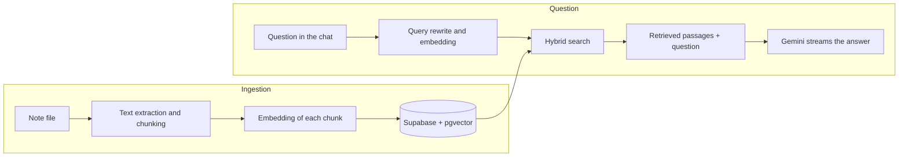

# 🤖 AI Assistant Infra


An AI chat that answers from personal notes, using RAG (retrieval-augmented generation).

I built this project for my father, who over the years has collected a large set of notes about infrastructure problems and their solutions (Unix, Linux, cloud). Instead of searching file by file, he asks in plain language and the assistant answers based on what he wrote himself.

> 🇧🇷 The app interface is in Portuguese. Questions can be asked in Portuguese or English.

## ✨ Features

- 💬 **RAG chat:** every question retrieves the most relevant passages from the notes and hands them to the model as context. Each answer shows which files those passages came from.
- 🔎 **Hybrid search:** combines semantic search (vectors) with exact-term search, such as server names, IPs and error codes.
- 🌐 **Bilingual, conversation-aware retrieval:** before searching, the question is rewritten as a standalone query in Portuguese and in English. Follow-up questions ("and on Ubuntu?") and questions in English still find the notes, and the answer comes back in the language of the question.
- ⚡ **Streaming answers** with Markdown and code blocks with a copy button. The message field accepts multiple lines, for pasting logs and configuration snippets.
- 🌍 **Web search (optional):** when a question needs current information, the model can search the web and cite its sources, complementing what is in the notes.
- 🗂️ **Conversation history:** conversations are saved per user and can be reopened, renamed and deleted from the sidebar.
- 📄 **Notes managed in the app:** upload (`.txt`, `.md`, `.docx`, scripts and configuration files) and delete notes without touching a terminal.
- 🔐 **Restricted access:** email and password login, an allowlist of authorized emails, and password change by the user.
- 🛟 **Fallback model:** if the main model is unavailable, the question is automatically resent to a second model.
- 📱 **Responsive layout** for desktop and mobile.

## 🧠 How it works



1. 📥 **Ingestion:** the text of each file is split into chunks of up to 1000 characters, respecting paragraphs, headings and code blocks. Each chunk becomes a 768-dimension vector and is stored in Postgres with `pgvector`, along with a full-text search index.
2. 🔎 **Retrieval:** the question is rewritten with the conversation context, in Portuguese and in English, and turned into a vector. A SQL function finds the closest chunks by cosine similarity and, in parallel, the chunks containing rare terms from the question, then merges both lists with Reciprocal Rank Fusion.
3. ✍️ **Generation:** the retrieved chunks go into the model instructions, and the model answers giving priority to the content of the notes.

## 🛠️ Tech stack

| Layer | Technology |
|---|---|
| Application | Next.js 16 (App Router), React 19, TypeScript |
| Interface | Tailwind CSS 4, lucide-react, react-markdown |
| AI | AI SDK 7, Gemini (`gemini-3.8-flash`, with `gemini-3.5-flash-lite` as fallback) |
| Embeddings | `gemini-embedding-2` (768 dimensions) |
| Web search | Tavily Search API, exposed to the model as a tool |
| Database and vector search | Supabase (Postgres + pgvector) |
| Authentication | Supabase Auth, with cookie-based sessions (`@supabase/ssr`) |

## 🚀 Running locally

Requirements: Node.js 20 or later, a [Supabase](https://supabase.com) project and a [Gemini API](https://aistudio.google.com/apikey) key.

1. Install the dependencies:

   ```bash
   npm install
   ```

2. Create the tables and search functions by running the contents of [`supabase/schema.sql`](supabase/schema.sql) in the Supabase SQL Editor.

3. In the Supabase dashboard, under Authentication, create a user with email and password and disable new sign-ups.

4. Copy `.env.example` to `.env.local` and fill in the variables:

   | Variable | Description |
   |---|---|
   | `NEXT_PUBLIC_SUPABASE_URL` | Supabase project URL |
   | `NEXT_PUBLIC_SUPABASE_ANON_KEY` | Public key (anon/publishable), used for login |
   | `SUPABASE_SERVICE_ROLE_KEY` | Service key, used only on the server |
   | `GOOGLE_GENERATIVE_AI_API_KEY` | Gemini API key |
   | `ALLOWED_EMAILS` | Emails allowed to sign in, separated by commas |
   | `TAVILY_API_KEY` | Optional. [Tavily](https://tavily.com) key for web search |

5. Start the development server and open `http://localhost:3000`:

   ```bash
   npm run dev
   ```

Notes can be uploaded on the **Anotações** (Notes) screen of the app. As an alternative, place the files in `scripts/notas/` and run:

```bash
npm run ingest
```

## 📁 Project structure

```
app/
  page.tsx                  Chat and sidebar with the conversation history
  login/                    Login screen and sign-in / sign-out actions
  alterar-senha/            Password change
  anotacoes/                Upload, list and delete notes
  api/chat/                 Retrieval and streamed model answer
  api/conversations/        Conversation history
  api/notes/                Note upload and deletion
  api/keepalive/            Minimal database query, called by the daily schedule
lib/
  notes.ts                  Text extraction, embeddings and storage of notes
  chunking.ts               Splits text into chunks by paragraph and heading
  search-query.ts           Parses the bilingual query generated for retrieval
  conversations.ts          Reads and writes the history
  auth.ts                   User check for the API routes
  allowed-emails.ts         Allowlist of authorized emails
  supabase/                 Supabase clients for the server and the proxy
proxy.ts                    Refreshes the session and requires login on every route
scripts/ingest.ts           Batch ingestion from the command line (uses lib/notes.ts)
vercel.json                 Daily schedule that keeps the free database active
supabase/schema.sql         Tables and search functions
```

## ⚖️ Decisions and limitations

- 👤 **Personal use:** the app is designed for a few trusted users. Each one has their own conversation history, but the notes form a single knowledge base shared by the authorized emails.
- 🛡️ **Layered security:** `proxy.ts` blocks anyone who is not signed in, and every API route checks the session again before answering. The tables have RLS enabled and are only accessed by the server.
- 💸 **Zero cost:** everything runs on the free tiers of Supabase, Gemini, Tavily and Vercel. On the Gemini free tier, submitted content may be used by Google to improve its products, so the notes should not contain passwords or sensitive data.
- 🎯 **Hybrid search without reranking:** retrieval returns up to 6 passages per question, combining vectors and exact terms. There is no reranker after retrieval, and quality is not yet measured against an evaluation set of questions.

## 🗺️ Roadmap

- Chat command to save quick notes.
- Password recovery by email.
- Automated tests, CI and a retrieval evaluation set.
