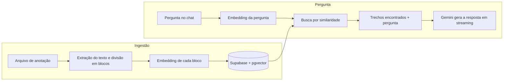

# Assistente de Infraestrutura

Chat com IA que responde a partir de anotações pessoais, usando RAG (geração aumentada por recuperação).

Construí este projeto para o meu pai, que acumulou ao longo dos anos muitas anotações sobre problemas e soluções de infraestrutura (Unix, Linux, cloud). Em vez de procurar arquivo por arquivo, ele pergunta em linguagem natural e o assistente responde com base no que ele mesmo escreveu.

## Funcionalidades

- **Chat com RAG:** cada pergunta busca os trechos mais relevantes das anotações e os entrega ao modelo como contexto. A resposta mostra de quais arquivos esses trechos vieram.
- **Busca híbrida:** combina a busca por significado (vetores) com a busca por termos exatos, como nomes de servidor, IPs e códigos de erro.
- **Busca com contexto da conversa:** perguntas de continuação ("e no Ubuntu?") são reescritas como uma consulta completa antes da busca.
- **Respostas em streaming**, com Markdown e blocos de código com botão de copiar. O campo de mensagem aceita várias linhas, para colar logs e trechos de configuração.
- **Pesquisa na internet (opcional):** quando a pergunta pede informações atuais, o modelo pode consultar a web e citar as fontes, complementando o que está nas anotações.
- **Histórico de conversas:** as conversas ficam salvas por usuário e podem ser reabertas, renomeadas e excluídas pela barra lateral.
- **Gerenciamento de anotações pelo app:** envio de arquivos (`.txt`, `.md`, `.docx`, scripts e arquivos de configuração) e exclusão, sem precisar de terminal.
- **Acesso restrito:** login por e-mail e senha, com lista de e-mails autorizados e troca de senha pelo próprio usuário.
- **Modelo reserva:** se o modelo principal estiver indisponível, a pergunta é reenviada automaticamente a um segundo modelo.
- **Layout responsivo**, para uso no computador e no celular.

## Como funciona



1. **Ingestão:** o texto de cada arquivo é dividido em blocos de até 1000 caracteres, respeitando parágrafos, títulos e blocos de código. Cada bloco vira um vetor de 768 dimensões e é gravado no Postgres com `pgvector`, junto com um índice de busca textual.
2. **Recuperação:** a pergunta é reescrita com o contexto da conversa e vira um vetor. Uma função SQL busca os blocos mais próximos por similaridade de cosseno e, em paralelo, os que contêm termos raros da pergunta, e junta as duas listas por Reciprocal Rank Fusion.
3. **Geração:** os blocos encontrados entram nas instruções do modelo, que responde priorizando o conteúdo das anotações.

## Tecnologias

| Camada | Tecnologia |
|---|---|
| Aplicação | Next.js 16 (App Router), React 19, TypeScript |
| Interface | Tailwind CSS 4, lucide-react, react-markdown |
| IA | AI SDK 7, Gemini (`gemini-3.8-flash`, com `gemini-3.5-flash-lite` como reserva) |
| Embeddings | `gemini-embedding-2` (768 dimensões) |
| Pesquisa na web | Tavily Search API, exposta ao modelo como ferramenta |
| Banco e busca vetorial | Supabase (Postgres + pgvector) |
| Autenticação | Supabase Auth, com sessão em cookies (`@supabase/ssr`) |

## Como rodar localmente

Pré-requisitos: Node.js 20 ou superior, um projeto no [Supabase](https://supabase.com) e uma chave da [API do Gemini](https://aistudio.google.com/apikey).

1. Instale as dependências:

   ```bash
   npm install
   ```

2. Crie as tabelas e a função de busca executando o conteúdo de [`supabase/schema.sql`](supabase/schema.sql) no SQL Editor do Supabase.

3. No painel do Supabase, em Authentication, crie um usuário com e-mail e senha e desative o cadastro de novos usuários.

4. Copie `.env.example` para `.env.local` e preencha as variáveis:

   | Variável | Descrição |
   |---|---|
   | `NEXT_PUBLIC_SUPABASE_URL` | URL do projeto no Supabase |
   | `NEXT_PUBLIC_SUPABASE_ANON_KEY` | Chave pública (anon/publishable), usada no login |
   | `SUPABASE_SERVICE_ROLE_KEY` | Chave de serviço, usada apenas no servidor |
   | `GOOGLE_GENERATIVE_AI_API_KEY` | Chave da API do Gemini |
   | `ALLOWED_EMAILS` | E-mails autorizados a entrar, separados por vírgula |
   | `TAVILY_API_KEY` | Opcional. Chave da [Tavily](https://tavily.com) para a pesquisa na internet |

5. Inicie o servidor de desenvolvimento e acesse `http://localhost:3000`:

   ```bash
   npm run dev
   ```

As anotações podem ser enviadas pela tela **Anotações** do app. Como alternativa, coloque os arquivos em `scripts/notas/` e rode:

```bash
npm run ingest
```

## Estrutura do projeto

```
app/
  page.tsx                  Chat e barra lateral com o histórico
  login/                    Tela de login e ações de entrar e sair
  alterar-senha/            Troca de senha
  anotacoes/                Envio, listagem e exclusão de anotações
  api/chat/                 Busca vetorial e resposta do modelo em streaming
  api/conversations/        Histórico de conversas
  api/notes/                Upload e exclusão de anotações
  api/keepalive/            Consulta mínima ao banco, chamada pelo agendamento
lib/
  notes.ts                  Extração de texto, embeddings e gravação das anotações
  chunking.ts               Divisão do texto em blocos por parágrafo e título
  conversations.ts          Leitura e gravação do histórico
  auth.ts                   Verificação do usuário nas rotas
  allowed-emails.ts         Lista de e-mails autorizados
  supabase/                 Clientes do Supabase para servidor e proxy
proxy.ts                    Renova a sessão e exige login em todas as rotas
scripts/ingest.ts           Ingestão em lote pela linha de comando (usa lib/notes.ts)
vercel.json                 Agendamento diário que mantém o banco gratuito ativo
supabase/schema.sql         Tabelas e funções de busca
```

## Decisões e limitações

- **Uso pessoal:** o app foi pensado para poucos usuários de confiança. Cada um tem o próprio histórico de conversas, mas as anotações formam uma base única, compartilhada entre os e-mails autorizados.
- **Segurança em camadas:** o `proxy.ts` barra quem não está logado, e cada rota de API confere a sessão de novo antes de responder. As tabelas têm RLS ativado e só são acessadas pelo servidor.
- **Custo zero:** tudo roda nas camadas gratuitas do Supabase e do Gemini. Na camada gratuita do Gemini, o conteúdo enviado pode ser usado pelo Google para melhorar os produtos, então as anotações não devem conter senhas nem dados sensíveis.
- **Busca híbrida sem reordenação:** a busca devolve até 6 trechos por pergunta, combinando vetores e termos exatos. Não há um modelo de reordenação (reranker) depois da busca, e a qualidade ainda não é medida por um conjunto de perguntas de avaliação.

## Próximos passos

- Comando no chat para registrar anotações rápidas.
- Recuperação de senha por e-mail.
